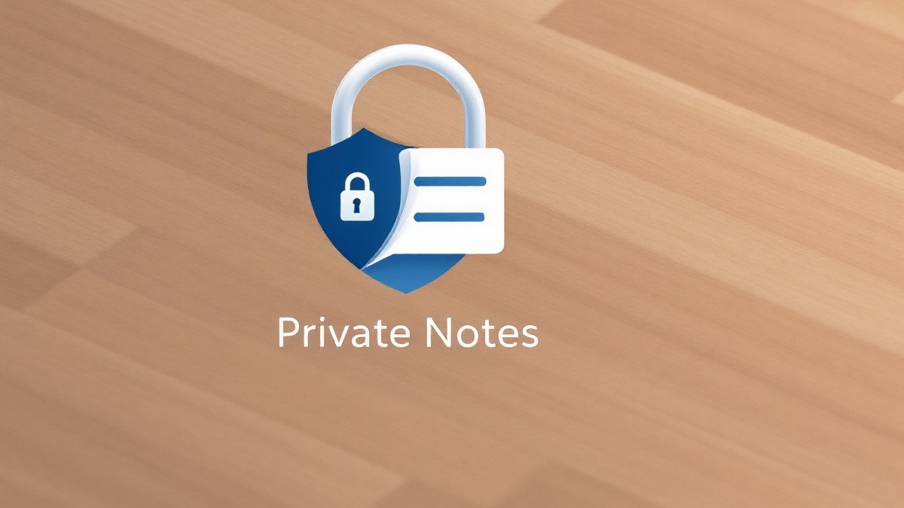

# Private Notes

**Private Notes** is a secure, open-source web application designed for managing personal notes locally on your device. It offers optional password-based encryption, ensuring your data remains private and protected without the need for cloud storage or external servers. With features like tagging, search functionality, and backup options, Private Notes provides a user-friendly platform for all your note-taking needs.



## Table of Contents

- [Features](#features)
- [Demo](#demo)
- [Installation](#installation)
  - [Online Usage](#online-usage)
  - [Local Testing](#local-testing)
  - [Server Deployment](#server-deployment)
- [Usage](#usage)
- [Technical Details](#technical-details)
- [Technologies Used](#technologies-used)
- [Contributing](#contributing)
- [License](#license)
- [Contact](#contact)

## Features

- 🔒 **Local Storage**: All notes are stored locally in your browser using IndexedDB (with localStorage fallback).
- 🔐 **Optional Encryption**: Password-based encryption using AES-GCM for sensitive notes.
- 🏷️ **Tag Organization**: Organize notes with customizable tags.
- 🎨 **Color Coding**: Personalize notes with custom colors.
- 📱 **PWA Support**: Install as a standalone app on mobile and desktop.
- 🔄 **Import/Export**: Backup and restore your notes in JSON format.
- 📝 **Rich Text Support**: Basic text formatting capabilities.
- 🔍 **Search**: Full-text search across notes and tags.
- 🎯 **Filters**: Filter notes by tags and sort by various criteria.
- 🖱️ **Drag & Drop**: Manual note reordering.
- 🌐 **Offline First**: Works without an internet connection.
- 🔄 **Auto Updates**: Automatic updates when new versions are available.

## Demo

You can try out the application live [here](https://notes.idrix.fr).

## Installation

### Online Usage

No installation is required for online use. Simply visit the [live demo](https://notes.idrix.fr) to start managing your notes.

### Local Testing

To run Private Notes locally for testing purposes, follow these steps:

1. **Clone the Repository**

   ```bash
   git clone https://github.com/idrassi/private-notes.git
   ```

2. **Navigate to the Project Directory**

   ```bash
   cd private-notes
   ```

3. **Serve the Application**

   You can use any static server to serve the application. For example, using Python's built-in server:

   ```bash
   python -m http.server 8000
   ```

4. **Access the Application**

   Open your browser and navigate to `http://localhost:8000`.

### Server Deployment

To deploy Private Notes on a server, follow these steps:

1. **Clone the Repository to Your Server**

   ```bash
   git clone https://github.com/idrassi/private-notes.git
   ```

2. **Configure HTTPS**

   Private Notes requires HTTPS to function correctly, especially for service workers and secure storage. Ensure your server is configured with a valid SSL certificate.

3. **Modify Configuration Files**

   - **`.htaccess` File**: The repository includes an `.htaccess` file with various configurations for Apache servers, including security headers and HTTPS enforcement. If you're not using an Apache server, you'll need to translate the `.htaccess` configurations to your server's configuration format. This includes setting up the correct security headers and HTTPS redirection.

   - **Update URLs**: Replace instances of `notes.idrix.fr` in the `.htaccess` file and `index.html` with your actual domain name.

     - In `.htaccess`, update the `Content-Security-Policy` header to reflect your domain.
     - In `index.html`, update any meta tags or links that reference `notes.idrix.fr`.

4. **Deploy Files to Server**

   Upload the application files to the appropriate directory on your web server.

5. **Restart Web Server**

   After making configuration changes, restart your web server to apply the new settings.

6. **Access the Application**

   Open your browser and navigate to your domain to access Private Notes.

## Usage

### Creating a Note

- Click on the **Add Note** button (floating action button with a plus icon).
- Enter your note title and content.
- Optionally, set a background color, add tags, or enable encryption.
- Click **Save** to store the note locally.

### Encrypting a Note

- While creating or editing a note, click on the **Lock** icon.
- Check the **Encrypt note** option.
- Enter and confirm your password when prompted.
- The note content will be encrypted and can only be viewed or edited with the correct password.

### Searching Notes

- Use the search bar at the top to find notes by title, content, or tags.
- Results will appear in real-time as you type.

### Tagging and Filtering

- Add tags to your notes to organize them.
- Click on the **Filter** button to filter notes by tags or change the sort order.

### Backup and Restore

- **Export Notes**: Click on the **Export Notes** option in the menu to download all your notes as a JSON file.
- **Import Notes**: Click on the **Import Notes** option and select a JSON file to restore notes.

### Installing as PWA

- Click on the **Install App** button when prompted to install Private Notes as a Progressive Web App on your device.
- The app can then be used offline and will appear in your app list.

## Technical Details

### Data Storage

- **IndexedDB**: Primary storage mechanism for notes, providing efficient and structured data management.
- **LocalStorage**: Automatic fallback if IndexedDB is not supported by the browser.

### Encryption

- **Key Derivation**: Uses PBKDF2-HMAC-SHA256 with 1,000,000 iterations to derive a strong key from your password.
- **Encryption Algorithm**: Employs AES-GCM for encrypting note content, providing both confidentiality and integrity.
- **Salt and IV**: Generates unique random salt and initialization vector (IV) for each encrypted note.
- **Web Crypto API**: All cryptographic operations are performed using the browser's built-in Web Crypto API.

### Backup and Restore

- Notes can be exported and imported in JSON format.
- No external services are involved; all operations are performed locally.

### Security Headers

The application includes a `.htaccess` file configured with security headers to enhance security:

- **Strict-Transport-Security**: Enforces HTTPS.
- **Content Security Policy**: Restricts sources for scripts, styles, images, etc.
- **Referrer Policy**: Controls the information sent in the `Referer` header.
- **X-Content-Type-Options**: Prevents MIME type sniffing.
- **X-Frame-Options**: Protects against clickjacking.
- **Permissions Policy**: Disables unused features like geolocation and camera.

**Note**: If you're using a different web server, you'll need to adapt these configurations accordingly.

## Technologies Used

- **HTML5 & CSS3**: For structuring and styling the application.
- **JavaScript (ES6+)**: Core logic and functionality.
- **IndexedDB & LocalStorage**: Local data storage solutions.
- **Web Crypto API**: Secure cryptographic operations.
- **Service Workers**: Enabling PWA features and offline access.
- **Font Awesome**: Iconography.

## Contributing

Contributions are welcome! Please follow these steps:

1. **Fork the Repository**

   Click the **Fork** button at the top-right corner of this page.

2. **Create a Branch**

   ```bash
   git checkout -b feature/YourFeatureName
   ```

3. **Commit Your Changes**

   ```bash
   git commit -m "Add your message"
   ```

4. **Push to Your Fork**

   ```bash
   git push origin feature/YourFeatureName
   ```

5. **Create a Pull Request**

   Go to the original repository and click on **Pull Requests**, then **New Pull Request**.

## License

This project is licensed under the [MIT License](LICENSE).

## Contact

Created by [Mounir IDRASSI](https://github.com/idrassi).

For questions or suggestions, feel free to open an issue or contact me directly via GitHub.

---

**Note**: Private Notes is designed with privacy and security in mind. However, always ensure you use strong, unique passwords and keep backups of your important data.